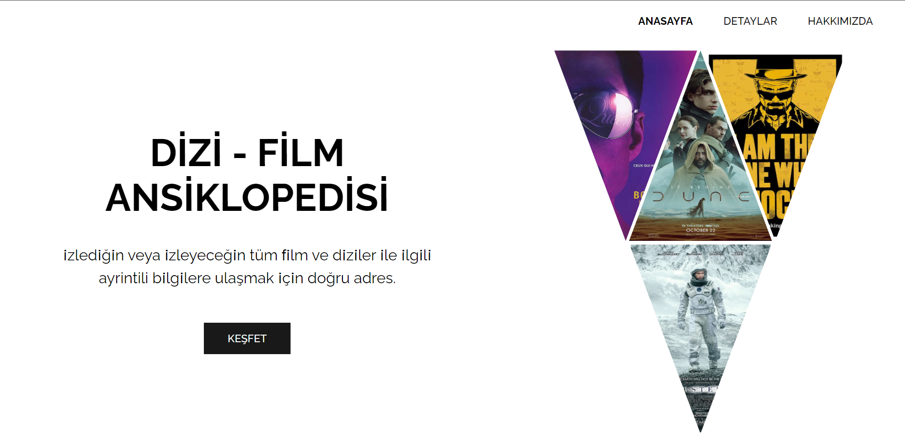
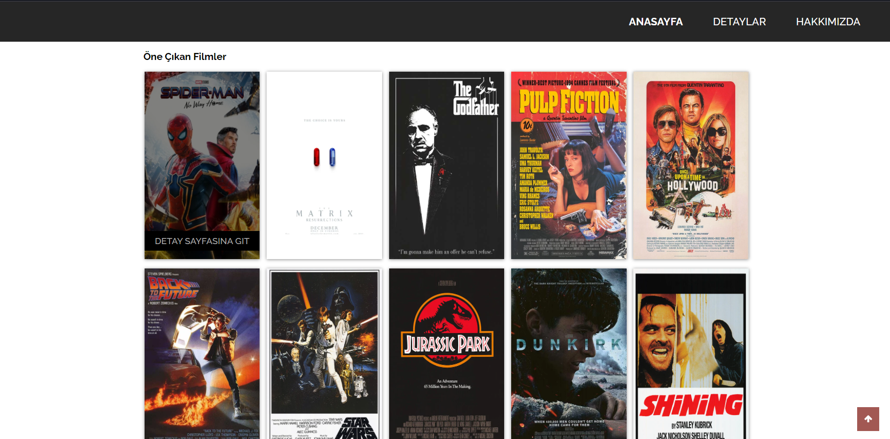
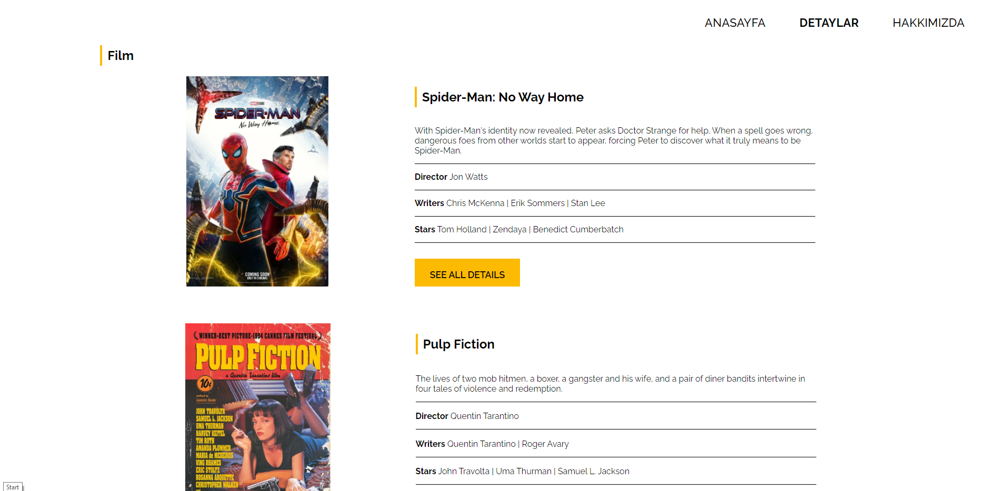
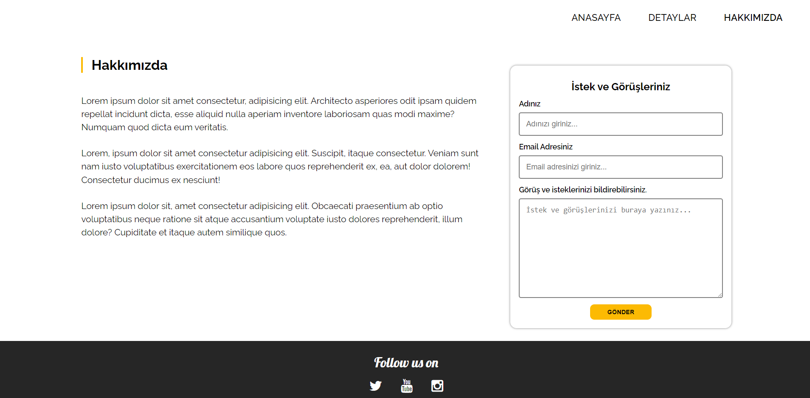

# Dizi - Film Bilgi Sitesi
---
Css dersleri kapsamında verilen birinci ödev için yapılan ve dizi film bilgilerinin yer aldığı bir site tasarımı

## Installation
---

Projeyi kendi bilgisayarınıza klonlamak için terminale aşağıdaki kodu yazabilirsiniz.
[https://github.com/omerfguldu/patika-dev](https://github.com/omerfguldu/patika-dev)

```

git clone https://github.com/omerfguldu/patika-dev.git

```

## Usage
---
Projeyi cloneladıktan sonra Visual Studio Code programını açınız.

Linux için:

```

cd patika-dev

code .

```

## Anasayfa
---

Anasayfa ekran görüntüsü 1:



Anasayfa ekran görüntüsü 2:



## Detaylar Sayfası
---

Detaylar sayfası ekran görüntüsü



## Hakkımızda Sayfası
---
 
Hakkımızda sayfası ekran görüntsü

