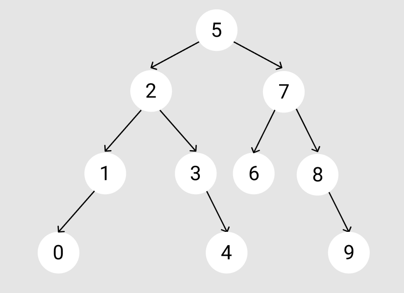

# Binary Search Tree

**[7, 5, 1, 8, 3, 6, 0, 9, 4, 2] dizisinin Binary Search Tree aşamaları:**

**Aşama 1** --> Root 5'tir ve en başa yazılır.

**Aşama 2** --> 5'in soluna 2, sağına ise 7 eklenir.

**Aşama 3** --> 2'nin soluna 1 sağına ise 3 eklenir. 7'nin sağına 8 soluna ise 6 eklenir.

**Aşama 4** --> 1'in soluna 0, 3'ün sağına 4 eklenir. 8'in sağına 9 eklenerek Binary Search Tree oluşturulur.

---

