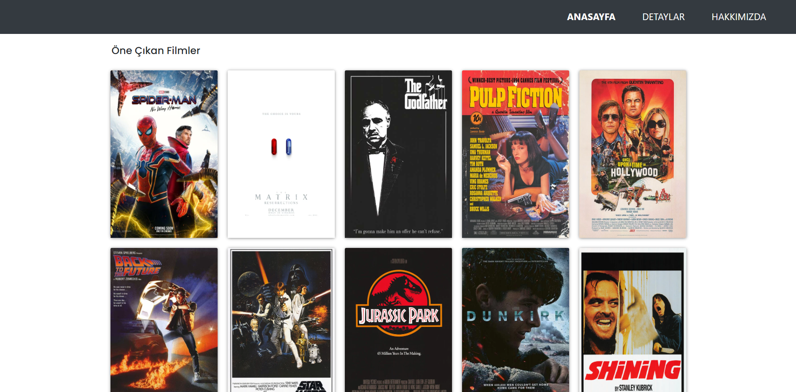
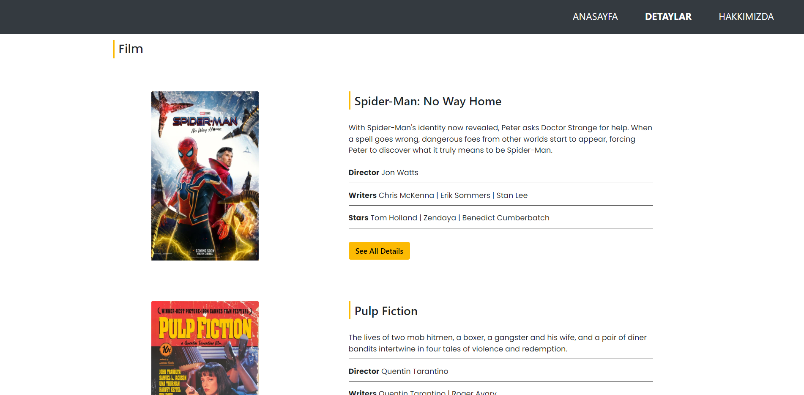
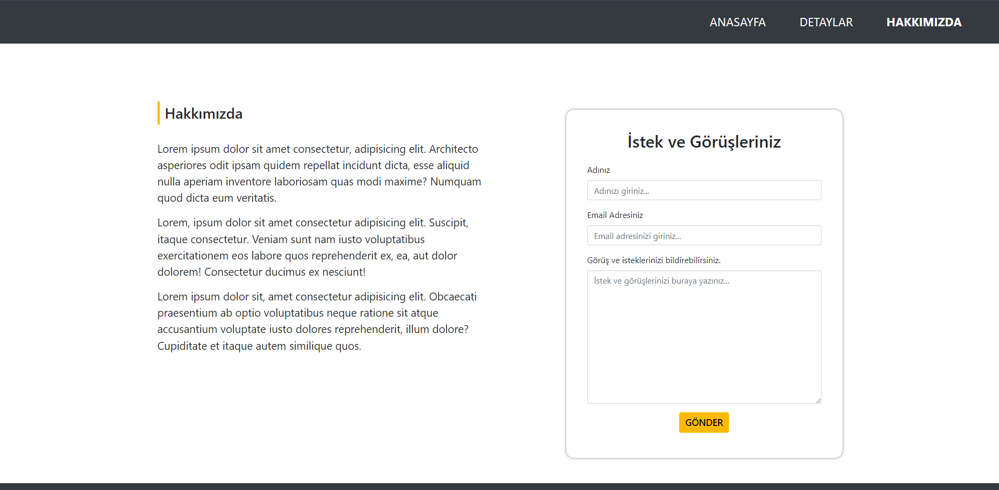

# Bootstrap Dizi - Film Info
---

Css derslerinde oluşturmuş olduğum dizi film bilgilerinin yer aldığı sitenin bootstrap kullanılarak yeniden oluşturulması

## Installation
---

Projeyi kendi bilgisayarınıza klonlamak için terminale aşağıdaki kodu yazabilirsiniz.
[https://github.com/omerfguldu/patika-dev.git](https://github.com/omerfguldu/patika-dev.git)

```

git clone https://github.com/omerfguldu/patika-dev.git

```

## Usage
---

Projeyi cloneladıktan sonra Visual Studio Code programını açınız.

Linux için:

```

cd patika-dev

code .

```

## Anasayfa
---

Anasayfa ekran görüntüsü 1:


Anasayfa ekran görüntüsü 2:



Detaylar ekran görüntüsü:



Hakkımızda ekran görüntüsü: 

