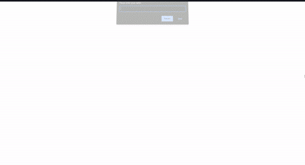

# Digital Clock and Welcome Screen
---

Kodluyoruz Frontend Web Development Patikası'nın Javascript modülünde yer alan ve 1. ödev olan dijital saat ve karşılama ekranı

## Installation
---

Projeyi kendi bilgisayarınıza klonlamak için terminale aşağıdaki kodu yazabilirsiniz. Klonlanan proje dosyası içerisinde yer alan javascript-todo-list klasörünün içerisinden proje kodlarına ulaşabilirsiniz. 
[https://github.com/omerfguldu/patika-dev.git](https://github.com/omerfguldu/patika-dev.git)
```

git clone https://github.com/omerfguldu/patika-dev.git

```

## Usage
---

Projeyi cloneladıktan sonra Visual Studio Code programını açınız.

Linux için:

```

patika-dev

code .

```

---

