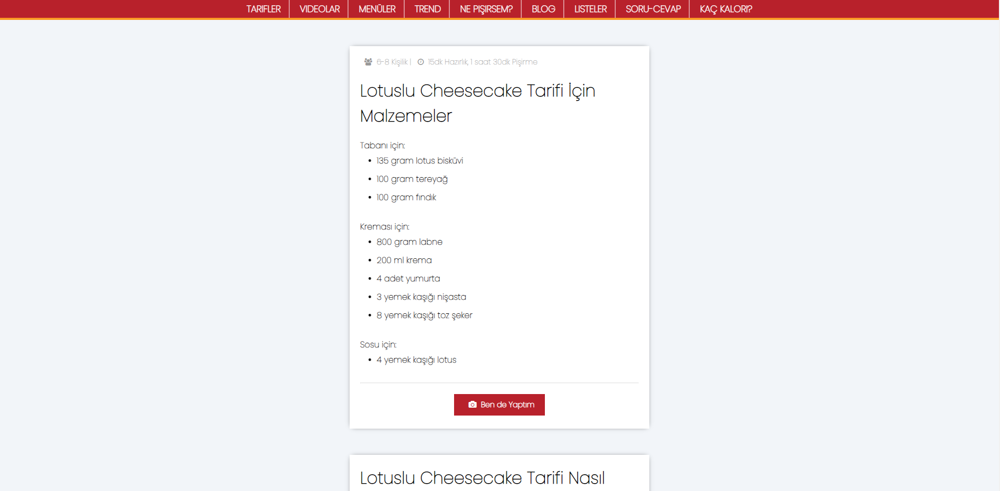
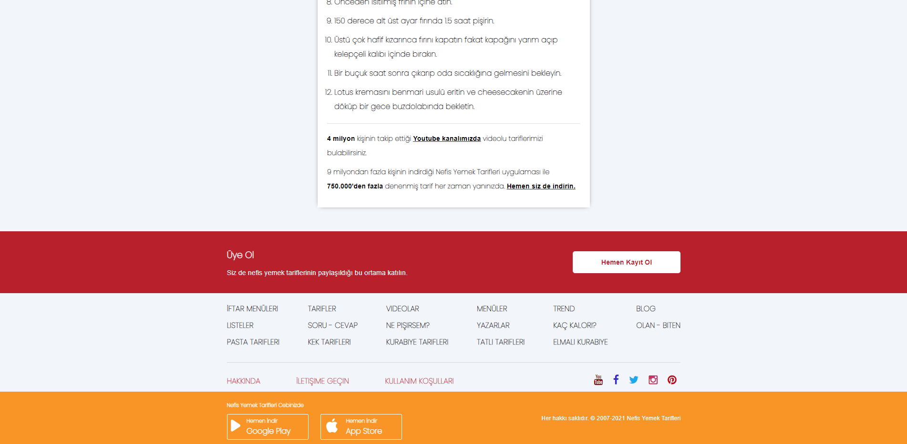

# Lotuslu Cheesecake Tarifi
---

HTML modülünde yer alan son ödev olan ve istediğimiz bir yemek tarifinin yapımını anlatan bir web sayfasının tasarımı yapılmıştır.

## Installation
---

Projeyi kendi bilgisayarınız klonlamak için terminale aşağıda yer alan kodu kopyalayın. [https://github.com/omerfguldu/patika-dev.git](https://github.com/omerfguldu/patika-dev.git)

```
git clone https://github.com/omerfguldu/patika-dev.git

```
## Usage

---

Projeyi clonladıktan sonra Visual Studio Code programını açınız.

Linux için:

```
cd patika-dev

code .

```

## Ekran Görüntüleri

---



---




