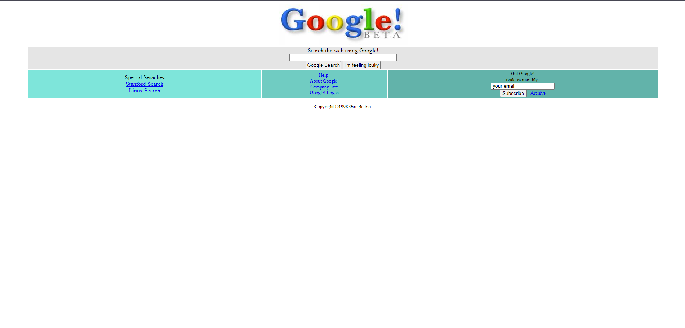

# Google 1998 Design
---
Css dersleri kapsamında verilen ikinci ödev olan Google'ın 1998 yılındaki tasarımının oluşturulması

## Installation
---

Projeyi kendi bilgisayarınıza klonlamak için terminale aşağıdaki kodu yazabilirsiniz.
[https://github.com/omerfguldu/patika-dev.git](https://github.com/omerfguldu/patika-dev.git)

```

git clone https://github.com/omerfguldu/patika-dev.git

```

## Usage
---
Projeyi cloneladıktan sonra Visual Studio Code programını açınız.

Linux için:

```

cd patika-dev

code .

```

## Ekran Görüntüsü
---

Ekran görüntüsü:


