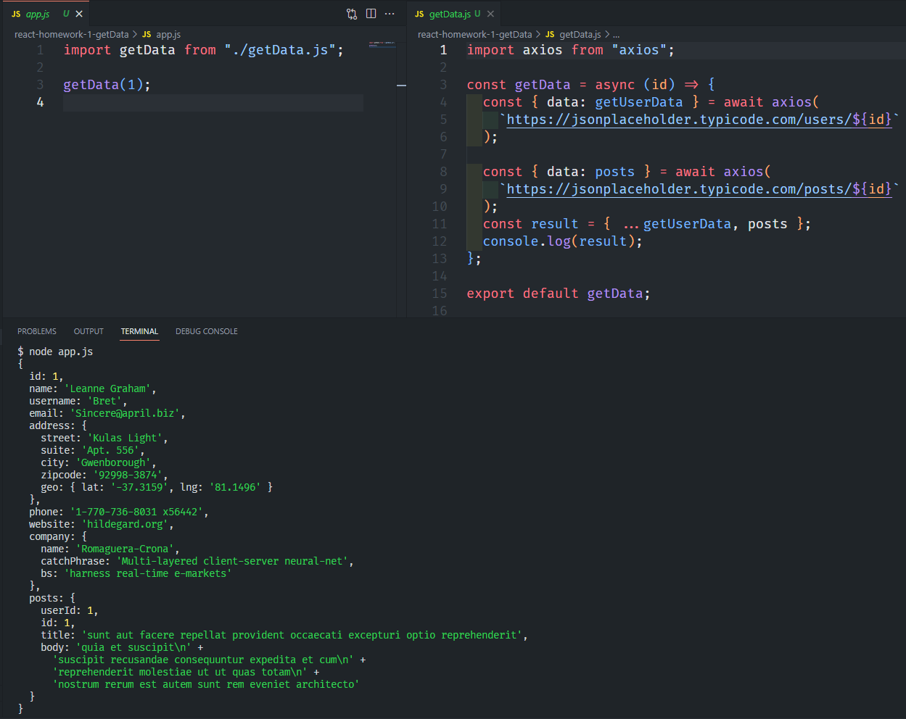

# React - Homework 1 - getData

---

React dersleri kapsamında verilen birinci ödev için yapılan ve axios ile verilen adresten getirilen veriyi yazdirma

## Installation

---

Projeyi kendi bilgisayarınıza klonlamak için terminale aşağıdaki kodu yazabilirsiniz.
[https://github.com/omerfguldu/patika-dev](https://github.com/omerfguldu/patika-dev)

```

git clone https://github.com/omerfguldu/patika-dev.git

```

## Usage

---

Projeyi cloneladıktan sonra Visual Studio Code programını açınız.

Linux için:

```

cd patika-dev

code .

```

## Gelen verilerin terminalde gosterimi:

---

Ekran görüntüsü :


